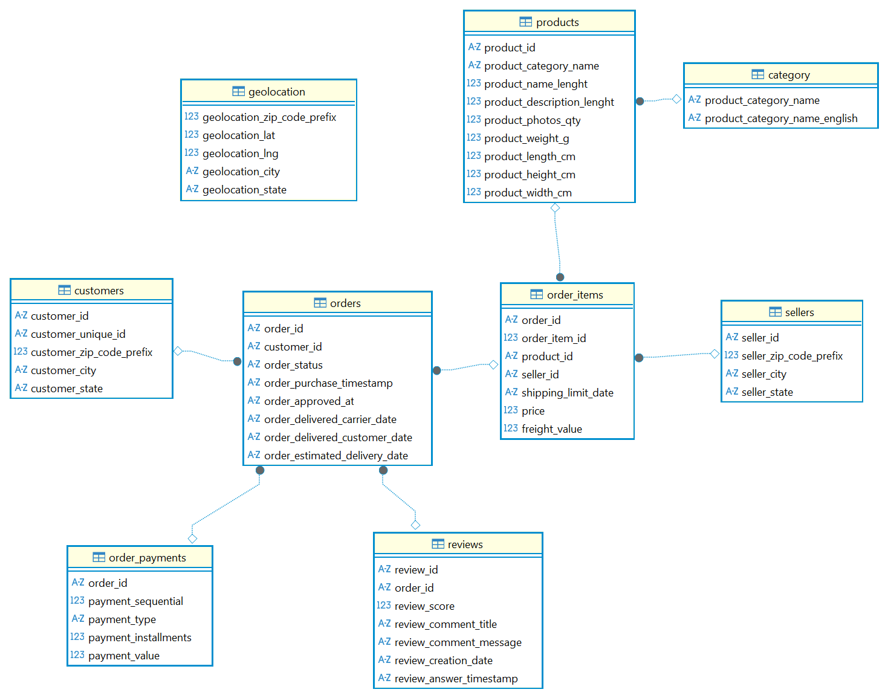

# 데이터 모델링

## 1. 개요

Olist 이커머스 데이터셋의 구조를 이해하기 위해 테이블 간 관계를 분석하고 ERD(Entity Relationship Diagram)를 작성하였다.

원본 데이터는 CSV 형태로 제공되어 실제 Primary Key(PK)와 Foreign Key(FK)가 데이터베이스에 설정되어 있지 않았다. 따라서 컬럼의 고유성과 테이블 간 관계를 분석하여 논리적인 데이터 모델을 구성하였다.

---

## 2. 테이블 간 관계

분석 결과 다음과 같은 관계를 확인하였다.

| 부모 테이블 | 자식 테이블 | 연결 컬럼 |
| :--------- | :--------- | :------- |
| customers | orders | customer_id |
| orders | order_items | order_id |
| orders | order_payments | order_id |
| orders | reviews | order_id |
| products | order_items | product_id |
| sellers | order_items | seller_id |
| category | products | product_category_name |

---

## 3. 논리적 기본키(PK)

원본 데이터에는 PK 제약조건이 존재하지 않으므로 다음 컬럼을 논리적인 기본키로 판단하였다.

| 테이블 | 논리적 PK |
| :----- | :-------- |
| customers | customer_id |
| orders | order_id |
| products | product_id |
| sellers | seller_id |
| category | product_category_name |
| order_items | (order_id, order_item_id) |
| order_payments | (order_id, payment_sequential) |

> `reviews`와 `geolocation` 테이블은 원본 데이터만으로 신뢰할 수 있는 단일 기본키를 확인하기 어려워 별도의 PK를 지정하지 않았다.

---

## 4. 모델링 과정

- 실제 데이터베이스에는 PK/FK 제약조건을 추가하지 않았다.
- DBeaver의 Virtual Key를 이용하여 논리적인 관계를 표현하였다.
- `geolocation` 테이블은 `geolocation_zip_code_prefix` 값이 중복되므로 다른 테이블과 연결하지 않았다.
- 원본 데이터를 최대한 유지하면서 분석에 필요한 관계만 ERD에 표현하였다.

---

## 5. ERD

